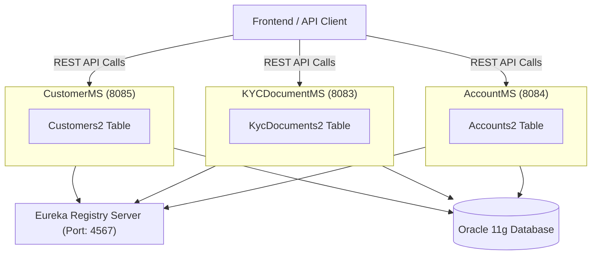

# 🏦 Banking Fundamentals

**Banking Fundamentals** is a microservices-based application built using **Spring Boot**, **Spring Cloud Eureka**, and **Oracle 11g**.  
The system is designed to manage core banking functionalities such as **customer management**, **KYC document verification**, and **account handling**.

---

## 🧩 Project Architecture

This project consists of **three microservices** and a **Registry Server (Eureka)**:

1. **CustomerMS** – Manages customer information and registration.  
2. **KYCDocumentMS** – Handles KYC (Know Your Customer) document uploads, verification, and status management.  
3. **AccountMS** – Manages customer bank accounts, including creation, updates, and status tracking.  
4. **Registry Server** – Eureka service registry for service discovery.

---

## ⚙️ Technologies Used

- **Java (Spring Boot)**  
- **Spring Cloud Netflix Eureka**  
- **Oracle 11g Database**  
- **Swagger UI** for API documentation  
- **Maven** for build and dependency management  
- **STS (Spring Tool Suite)** as IDE

---

## 🗺️ System Architecture Diagram

---

## 🚀 Getting Started

Follow these steps to run the project locally:

**1. Clone the repository**

git clone <repo-url>

cd banking-fundamentals

**2. Setup Oracle Database**

Install Oracle 11g and start the service.

Run the SQL scripts to create the required tables:

**-- Customers table**

CREATE TABLE customers2 (
  customer_id   VARCHAR2(36) PRIMARY KEY,
  
  full_name     VARCHAR2(200) NOT NULL,
  
  email         VARCHAR2(150) NOT NULL,
  
  phone         VARCHAR2(20) NOT NULL,
  
  dob           DATE NOT NULL,
  
  address       VARCHAR2(4000),
  
  pan           VARCHAR2(10) NOT NULL,
  
  aadhaar       VARCHAR2(12) NOT NULL,
  
  created_at    TIMESTAMP DEFAULT SYSTIMESTAMP
  
);

**-- KYC Documents table**

    CREATE TABLE kyc_documents2 (
      doc_id        VARCHAR2(36) PRIMARY KEY,
      
      customer_id   VARCHAR2(36),
      
      doc_type      VARCHAR2(20) NOT NULL,
      
      file_name     VARCHAR2(255),
      
      file_base64   CLOB,
      
      status        VARCHAR2(20) DEFAULT 'PENDING',
      
      admin_comment VARCHAR2(2000),
      
      uploaded_at   TIMESTAMP DEFAULT SYSTIMESTAMP,
      
      CONSTRAINT fk_customer2
      
          FOREIGN KEY (customer_id)
          
          REFERENCES customers2(customer_id)
          
          ON DELETE CASCADE
          
    );

**-- Accounts table**

CREATE TABLE accounts2 (
    account_id        VARCHAR2(36) PRIMARY KEY, 
    customer_id       VARCHAR2(36) NOT NULL, 
    account_number    VARCHAR2(12) UNIQUE NOT NULL, 
    account_type      VARCHAR2(20) NOT NULL, 
    account_status    VARCHAR2(20) DEFAULT 'ACTIVE', 
    account_balance   NUMBER(15,2) DEFAULT 0 NOT NULL, 
    created_at        TIMESTAMP DEFAULT SYSTIMESTAMP, 
    CONSTRAINT fk_customers2 FOREIGN KEY (customer_id) 
        REFERENCES customers2(customer_id) 
        ON DELETE CASCADE, 
    CONSTRAINT uq_customer_account_type UNIQUE (customer_id, account_type) 
);

**3. Start the Eureka Registry**

cd RegistryServer

mvn spring-boot:run

**4. Start the Microservices**

Start each service (order doesn’t matter if Eureka is running):

CustomerMS: port 8085

KYCDocumentMS: port 8083

AccountMS: port 8084

**5. Access Swagger UI**

CustomerMS: http://localhost:8085/swagger-ui.html

KYCDocumentMS: http://localhost:8083/swagger-ui.html

AccountMS: http://localhost:8084/swagger-ui.html

---

## 🛠️ API Overview
**CustomerMS**

GET	/api/customers/{customerId} ->	Get customer by ID

PUT	/api/customers/{customerId} ->	Update customer details 
PATCH	/api/customers/{customerId} ->	Partially update customer 
DELETE	/api/customers/{customerId} ->	Delete customer 
POST	/api/customers/register ->	Register a new customer 
GET	/api/customers/all ->	Get all customers 

**KYCDocumentMS** 
POST	/api/kyc/upload-all ->	Upload PAN, Aadhaar, and Photo 
POST	/api/kyc/reupload/{docId} ->	Reupload a rejected KYC document 
POST	/api/kyc/verify/{docId} ->	Approve or reject a KYC document 
GET	/api/kyc/{docId} ->	Get details of a specific KYC document 
GET	/api/kyc/view/{docId} ->	Download/view KYC document as file 
GET	/api/kyc/view/customer/{customerId} ->	View all documents uploaded by a customer 
GET	/api/kyc/status/{customerId} ->	Get overall KYC status 
GET	/api/kyc/pending ->	Get all pending KYC documents 

**AccountMS** 
POST	/api/accounts/create ->	Create a new account for a customer 
PUT	/api/accounts/{accountId} ->	Fully update account details 
PATCH	/api/accounts/{accountId} ->	Partially update account 
DELETE	/api/accounts/{accountId} ->	Delete an account 
GET	/api/accounts/customer/{customerId} ->	Get account of a customer 
GET	/api/accounts/all ->	Get all accounts 

---

## 📝 Contributing

Fork the repository.

Create a feature branch (git checkout -b feature/YourFeature).

Commit your changes (git commit -m 'Add some feature').

Push to the branch (git push origin feature/YourFeature).

Create a Pull Request.

---

## 📄 License

This project is licensed under the MIT License.

---

## 💡 Notes

Ensure the Oracle DB is running before starting microservices.

Ports must be available (8083, 8084, 8085, 4567) for services to run.

Swagger UI provides an easy interface to test all APIs.
